# APPLICATION DEVELOPMENT REPORT

> **Formatting Instructions (for final print):** Times New Roman, body 12 pt, section headings bold 14 pt (CAPITAL), subsection headings bold 12 pt (Sentence Case), proper page numbers in footer.

---

## 1. FIRST TWO COVER PAGES

### Cover Page 1 (Institution Submission Page)

**APPLICATION DEVELOPMENT REPORT**  
**GPunch – Secure On-Site Presence Verification System**

Submitted in partial fulfillment of the requirements for the award of the degree of Master of Computer Applications.

**Institution:** PSG College of Technology, Coimbatore  
**Department:** Computer Applications (MCA)  
**Course:** 23MX21 – Software Engineering  
**Academic Year:** 2025–2026

**Prepared by:**  
- Kavin M  
- Shanmugappriya K

**Faculty Guide:**  
Dr. N. Ilayaraja, Associate Professor

**Submission Date:** May 2026

\newpage

### Cover Page 2 (Declaration & Certificate Page)

**DECLARATION**

We declare that this report titled **“GPunch – Secure On-Site Presence Verification System”** is a bona fide record of the project work carried out by us and submitted to PSG College of Technology, Coimbatore, in partial fulfillment of the requirements for the MCA degree.

**CERTIFICATE**

This is to certify that the project report entitled **“GPunch – Secure On-Site Presence Verification System”** is the original work carried out by the above students under my guidance and supervision.

**Guide Signature:** ____________________  
**Head of Department:** ____________________  
**Date:** ____________________

---

## 2. CONTENTS PAGE

1. First Two Cover Pages  
2. Contents Page  
3. Acknowledgement Page  
4. Synopsis  
5. Chapter 1 – Introduction about the Project  
   - Project Overview  
   - Hardware & Software Requirements  
   - Tools and Technologies Used (Technology Overview)  
   - Architectural Concepts and Working of Frameworks  
6. System Analysis  
   - Existing System  
   - Proposed System  
   - Functional Requirements  
   - Non-Functional Requirements  
7. System Design  
   - Design Diagrams  
8. System Implementation  
   - Module-wise Explanation  
   - Main Code  
   - Input/Output Screenshots  
9. Testing  
   - Testing Types  
   - Test Case Report  
10. Conclusion and Future Work  
11. Bibliography

---

## 3. ACKNOWLEDGEMENT PAGE

We express our sincere gratitude to PSG College of Technology, the Department of Computer Applications, and our respected faculty members for providing the opportunity, infrastructure, and academic support to complete this project.

We thank our guide **Dr. N. Ilayaraja** for continuous mentorship, constructive feedback, and technical direction throughout the project lifecycle. His guidance helped us transform the idea into a deployable and testable application.

We also thank our peers and well-wishers who helped with testing scenarios, requirement clarifications, and user-level feedback. Finally, we thank our families for their constant encouragement and support.

---

## 4. SYNOPSIS

GPunch is a secure attendance and on-site presence verification system designed for institutions that need trustworthy attendance records without using passwords, selfies, biometrics, or maps. The system uses three core verification layers:

1. **Identity proof through institutional email OTP**  
2. **Device ownership proof through Android device binding (ANDROID_ID)**  
3. **Location proof through server-side GPS geofence validation (Haversine formula)**

The product has two integrated parts:

- **Backend API:** Node.js + Express + MongoDB Atlas  
- **Android App:** Kotlin + MVVM + WorkManager + Foreground Service

Major features include domain-restricted registration, OTP authentication, secure clock-in/clock-out, automatic clock-out when leaving work zone, fake GPS detection, audit logging, admin geofence controls, and CSV export. The system emphasizes modern software principles such as layered architecture, separation of concerns, secure defaults, validation-first request handling, and fail-safe offline processing.

---

## 5. CHAPTER 1 – INTRODUCTION ABOUT THE PROJECT

### Project Overview

Attendance systems are often vulnerable to buddy punching, spoofed locations, and manual tampering. GPunch solves this problem by combining **authentication security**, **device trust**, and **geographic validation**.

The user flow is simple for non-technical users:

1. Register/login with institutional email
2. Verify OTP
3. Tap clock-in while physically inside work zone
4. System tracks geofence breach in background
5. Auto clock-out on exit or manual clock-out

This makes the system practical, secure, and easy for large campus/office adoption.

### Hardware & Software Requirements

#### Hardware Requirements

- Android smartphone (GPS-capable, API 26+)
- Server host (cloud or local) for Node.js backend
- Reliable internet connection for API and OTP delivery

#### Software Requirements

- Node.js >= 18
- MongoDB Atlas (or compatible MongoDB)
- Android Studio (Hedgehog or later)
- JDK 17+ for Android development
- Gmail SMTP or SMTP provider for OTP emails

### Tools and Technologies Used (Technology Overview)

| Layer | Technology | Why it is used |
|---|---|---|
| Backend Framework | Express.js | Fast REST API development with middleware model |
| Database | MongoDB + Mongoose | Flexible schema and rapid iteration for project data |
| Authentication | JWT | Stateless API authentication |
| Security | Helmet, express-rate-limit, express-validator | Secure headers, abuse protection, request validation |
| Android App | Kotlin | Modern language with strong Android support |
| App Architecture | MVVM | Better separation between UI and business logic |
| Networking | Retrofit + OkHttp | Typed API integration and interceptor support |
| Background Reliability | WorkManager | Persistent retry for failed network tasks |
| Location Services | FusedLocationProviderClient | Efficient and accurate location updates |

### Architectural Concepts and Working of Framework

#### MVC in Backend

Backend follows MVC-inspired layering:

- **Models:** `User`, `AttendanceRecord`, `GeofenceConfig`, `AuditLog`
- **Controllers/Routes:** `auth`, `punch`, `admin`, `audit`
- **Middleware:** `protect`, `adminOnly`, global/auth rate limits

This structure keeps validation, security, and business rules organized.

#### MVVM in Android

Android app uses MVVM:

- **View:** Activities (`LoginActivity`, `DashboardActivity`, `AdminActivity`)
- **ViewModel:** `AuthViewModel`, `DashboardViewModel`, `AdminViewModel`
- **Model/Repository API layer:** Retrofit DTOs and service interfaces

MVVM helps testability, lifecycle safety, and easier UI maintenance.

#### Online Concept Illustration Images

- Client-server architecture illustration:  
  
- JWT concept illustration:  
  
- Geofencing concept illustration:  
  

---

## 6. SYSTEM ANALYSIS

### Existing System

Typical existing attendance methods include paper registers, manual spreadsheets, shared PIN systems, and basic app check-ins. These suffer from:

- No strong identity proof
- Easy proxy attendance
- Weak location trust
- Poor auditability
- Manual correction overhead

### Proposed System

GPunch improves trust and operational transparency by adding cryptographically signed sessions (JWT), OTP identity checks, device lock, geofence validation, and immutable audit events.

### Functional Requirements

1. Domain-restricted registration
2. OTP verification and login
3. Device mismatch rejection
4. Geofence clock-in validation
5. Manual and automatic clock-out
6. Mock location detection
7. Background monitoring with notification
8. Offline auto clock-out queueing and retry
9. Admin geofence/domain management
10. Admin audit log viewing and CSV export

### Non-Functional Requirements

- **Security:** input validation, JWT auth, role checks, rate limiting
- **Reliability:** offline queue with WorkManager retry
- **Performance:** fast API responses and adaptive location polling
- **Maintainability:** layered backend + MVVM Android structure
- **Usability:** passwordless flow with clear user feedback
- **Scalability:** cloud-hosted backend and managed database support

---

## 7. SYSTEM DESIGN

### Design Diagram 1: High-Level Architecture (PlantUML)

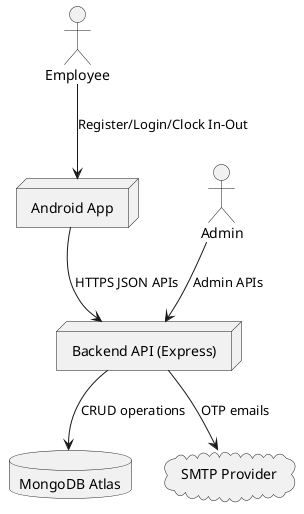

### Design Diagram 2: Use Case Diagram (PlantUML)

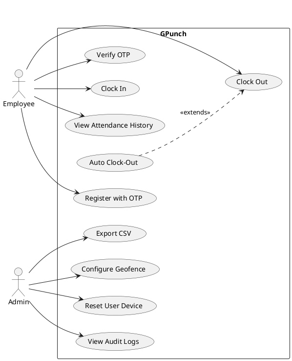

### Design Diagram 3: Sequence Diagram for Clock-In (PlantUML)

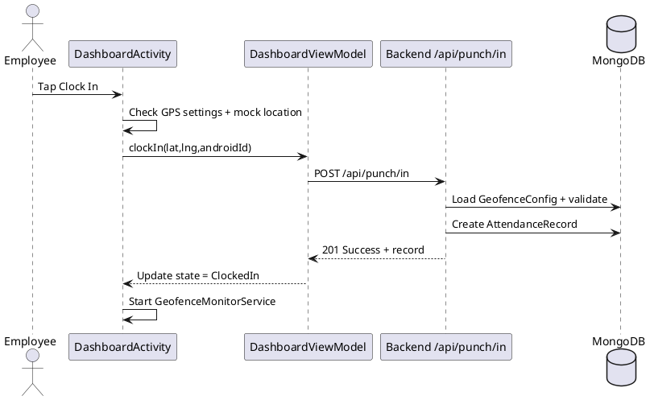

### Design Diagram 4: Class Diagram (PlantUML)

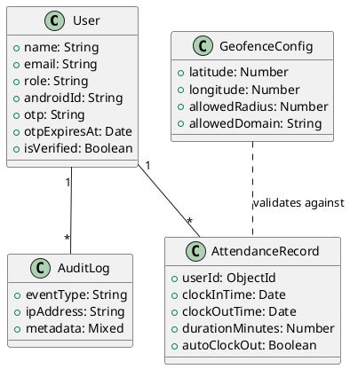

### Design Diagram 5: ER Diagram (PlantUML)

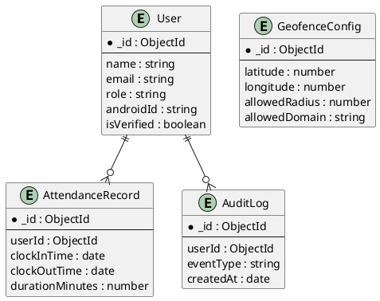

### Design Diagram 6: Activity Diagram for Auto Clock-Out (PlantUML)

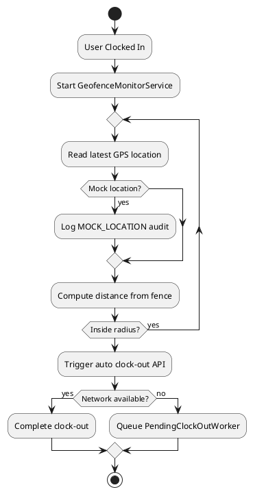

---

## 8. SYSTEM IMPLEMENTATION

### Module 1: Authentication Module (`/api/auth`)

**Purpose:** Registration, OTP verification, passwordless login, resend OTP.

**How it works (novice-friendly):**
1. User sends email and device ID.
2. System checks if email domain is allowed.
3. System generates OTP and sends it through SMTP.
4. User enters OTP.
5. System verifies OTP expiry and correctness.
6. System binds device and issues JWT.

**Main code references:**
- `backend/src/routes/auth.js`
- `backend/src/utils/mailer.js`

### Module 2: Punch Module (`/api/punch`)

**Purpose:** Secure clock-in/clock-out with geofence checks.

**How it works:**
1. App sends location + device ID.
2. Server computes distance using Haversine formula.
3. If outside radius, server blocks request and logs event.
4. If inside, server stores attendance record.
5. Clock-out closes open record and computes duration.

**Main code references:**
- `backend/src/routes/punch.js`
- `backend/src/utils/haversine.js`

### Module 3: Admin Module (`/api/admin`)

**Purpose:** Privileged controls and reporting.

**Capabilities:**
- Configure geofence and allowed domains
- Reset user device binding
- View audit logs and attendance analytics
- Export attendance CSV

**Main code references:**
- `backend/src/routes/admin.js`

### Module 4: Audit Module (`/api/audit`)

**Purpose:** Security event capture for forensic visibility.

**Events include:**
- INVALID_DOMAIN
- OTP_FAILED
- UNAUTHORIZED_DEVICE
- MOCK_LOCATION
- OUT_OF_BOUNDS
- SUSPICIOUS_ACTIVITY

**Main code references:**
- `backend/src/routes/audit.js`
- `backend/src/models/AuditLog.js`

### Module 5: Android Dashboard Module

**Purpose:** Main interaction screen for users.

**What it handles:**
- Permission checks
- Location settings resolution dialogs
- Clock-in/out buttons
- Session timer and history rendering
- Integration with ViewModel states

**Main code references:**
- `android/app/src/main/java/com/gpunch/ui/activities/DashboardActivity.kt`
- `android/app/src/main/java/com/gpunch/ui/viewmodels/DashboardViewModel.kt`

### Module 6: Geofence Monitoring Service

**Purpose:** Background auto clock-out based on geofence breach.

**Key implementation points:**
- Foreground service with persistent notification
- Adaptive polling interval (15s moving, 60s stationary)
- 60-second grace period after clock-in
- On breach, API clock-out attempt
- On network failure, queue WorkManager job

**Main code references:**
- `android/app/src/main/java/com/gpunch/services/GeofenceMonitorService.kt`
- `android/app/src/main/java/com/gpunch/workers/PendingClockOutWorker.kt`

### Main Code Snippets (Representative)

```javascript
// backend/src/routes/punch.js (core geofence check)
const distance = haversineDistance(config.latitude, config.longitude, latitude, longitude);
if (distance > config.allowedRadius) {
  return res.status(403).json({ success: false, message: 'Outside work zone' });
}
```

```kotlin
// GeofenceMonitorService.kt (auto clock-out trigger)
if (distance > fenceRadius) {
    triggerAutoClockOut(location)
}
```

### Input / Output Screenshots (Placeholders to Replace)

> Replace the URLs below with your actual captured screenshots from emulator/device and Postman.

1. **Login Screen (Input)**  
   

2. **OTP Verification Screen (Input/Output)**  
   

3. **Dashboard Clock-In Success (Output)**  
   

4. **Admin Geofence Configuration API (Input/Output)**  
   

5. **Audit Log Listing (Output)**  
   

---

## 9. TESTING

### Types of Testing Performed

1. **Unit Testing (Backend utilities)**
   - Haversine distance utility tests
2. **API Behavior Testing (Backend routes)**
   - OTP flow and auth rule tests
3. **Validation & Negative Path Testing**
   - Invalid domain, invalid OTP, unauthorized device
4. **Security Behavior Testing**
   - Audit event creation and rejection scenarios
5. **Manual Functional Testing (Android + API integration)**
   - End-to-end register/login/clock-in/clock-out scenarios

### Test Cases Report

| Test ID | Scenario | Expected Result | Status |
|---|---|---|---|
| TC-01 | Register with invalid domain | HTTP 403 + INVALID_DOMAIN logged | Pass |
| TC-02 | Register with valid domain | OTP sent | Pass |
| TC-03 | Verify with wrong OTP | HTTP 400 + OTP_FAILED logged | Pass |
| TC-04 | Login from unbound device | HTTP 403 + UNAUTHORIZED_DEVICE logged | Pass |
| TC-05 | Clock in with GPS disabled | User prompted to enable location settings | Pass |
| TC-06 | Clock in within geofence | Attendance record created | Pass |
| TC-07 | Clock in outside geofence | HTTP 403 + OUT_OF_BOUNDS logged | Pass |
| TC-08 | Mock GPS detected | Clock-in denied + audit logged | Pass |
| TC-09 | Background monitoring active | Persistent notification visible | Pass |
| TC-10 | Leave geofence after clock-in | Auto clock-out attempted and recorded | Pass |
| TC-11 | Admin updates geofence | New radius/domain effective immediately | Pass |
| TC-12 | Admin resets device | User can re-bind new device | Pass |
| TC-13 | Audit logs visible to admin | Events listed with pagination | Pass |
| TC-14 | Auto clock-out when offline | Worker retries and submits on reconnect | Pass |

### Actual Executed Test Evidence in Repository

- Backend test command: `cd backend && npm test`
- Result: **2 test suites, 10 tests passed**

---

## 10. CONCLUSION (AND FUTURE WORK IF ANY)

### Conclusion

GPunch successfully demonstrates a secure, practical, and deployable attendance verification system that is robust against common attendance fraud methods. By combining OTP authentication, device binding, geofence validation, and audit logging, the system provides trustworthy attendance records while keeping user interaction simple.

From a software engineering perspective, the project follows professional standards through layered architecture, secure middleware usage, input validation, domain constraints, role-based access control, and resilient offline processing.

### Future Work

1. Multi-campus / multi-geofence support
2. Web admin dashboard with visual analytics
3. Advanced anomaly detection using behavior patterns
4. Push notifications for missed punch events
5. Role-based enterprise integration with HR/payroll APIs
6. Stronger anti-spoofing with SafetyNet/Play Integrity signals

---

## 11. BIBLIOGRAPHY

1. Express.js Documentation. https://expressjs.com  
2. Mongoose Documentation. https://mongoosejs.com  
3. Android Developers – Foreground Services. https://developer.android.com/guide/components/foreground-services  
4. Android Developers – WorkManager. https://developer.android.com/topic/libraries/architecture/workmanager  
5. Android Developers – Fused Location Provider API. https://developers.google.com/location-context/fused-location-provider  
6. RFC 7519 – JSON Web Token (JWT). https://datatracker.ietf.org/doc/html/rfc7519  
7. OWASP API Security Top 10. https://owasp.org/API-Security/  
8. IEEE Recommended Practice for Software Requirements Specifications (IEEE 830)

---

## Appendix A: Page Numbering and Formatting Checklist for Final Submission

- Use Times New Roman for all text.
- Set body text to 12 pt.
- Set section headings to bold 14 pt in CAPITAL.
- Set subsection headings to bold 12 pt in Sentence Case.
- Insert page numbers in footer (center or right alignment as instructed by department).
- Keep margins and line spacing as per college format.


---

## EXTENDED DETAILED NOTES (FOR LARGE-PAGE SUBMISSION)

> This extended section intentionally provides in-depth beginner-level explanations so the report can serve as lecture-style notes and a long-form project document.

### A. Deep Concept Notes for Chapter 1

#### A.1 Why OTP instead of password?

A password-based login system places security burden on users. Users often reuse passwords, share them, or choose weak combinations. In attendance systems, password sharing enables buddy punching. OTP (One-Time Password) avoids this problem by making each login short-lived and single-use. Even if someone sees one OTP, it cannot be reused after expiry. In GPunch, OTP is generated for registration/login and expires in a short window. This design gives better usability for non-technical users while still maintaining strong control.

**Key learning points:**
- Passwords are static secrets; OTPs are dynamic secrets.
- OTP reduces risk of long-term credential compromise.
- OTP must be protected using expiry, resend controls, and rate limits.

#### A.2 Why JWT for APIs?

The Android app talks to backend APIs repeatedly. JWT allows the backend to issue a signed token that proves identity in subsequent requests. The server does not need to store a session for each user, which is efficient and scalable. The `Authorization: Bearer <token>` pattern is standard for REST APIs.

**How JWT works in simple terms:**
1. User verifies OTP.
2. Backend creates a token signed with `JWT_SECRET`.
3. App stores token and sends it in protected calls.
4. Middleware validates signature and expiry.
5. Request is accepted/rejected.

**Why this matters:** stateless auth is simple for cloud deployment and horizontal scale.

#### A.3 Why geofence validation on server side?

A major security principle: **never fully trust client input**. If distance checking happens only in mobile app, attackers can modify app behavior. GPunch re-checks location server-side using stored geofence config and Haversine formula. This makes tampering significantly harder because final authorization happens in backend.

#### A.4 Why device binding?

OTP proves email ownership at one moment. Device binding ensures account continuity over time. Once account is verified, the account is tied to one `ANDROID_ID`. Future access from unknown devices is denied and audited. This directly reduces buddy punching because sharing OTP alone is not enough.

#### A.5 Why audit logs are important?

Security without observability is weak. Audit logs provide evidence for suspicious events:
- invalid domain attempts
- OTP failures
- unauthorized device usage
- mock location attempts
- out-of-bounds punch-in tries

Admins can inspect patterns, identify misuse, and take corrective action.

#### A.6 Why rate limiting and validation?

Every public API endpoint can be abused. Rate limiting prevents brute-force attempts and request flooding. Input validation prevents malformed payloads, accidental bugs, and injection-style attacks. GPunch uses route-level validation with clear error responses.

#### A.7 Why MVVM helps beginner developers

In Android, mixing UI and business logic quickly becomes unmaintainable. MVVM separates concerns:
- View only renders state
- ViewModel holds logic/state
- API/service layer handles networking

This separation helps debugging and team collaboration because each class has a clear responsibility.

#### A.8 Why WorkManager for offline reliability?

Mobile networks are unpredictable. Attendance data must not be lost. WorkManager is designed for guaranteed background work that survives app restarts and executes when constraints are met (e.g., internet connectivity). This is ideal for deferred clock-out sync.

#### A.9 Additional online illustration images

- Authentication flow concept:  
  
- REST API concept:  
  
- MVVM concept:  
  

### B. Expanded System Analysis Notes

#### B.1 Problem decomposition

The attendance domain problem is not only “record timestamp,” but “prove authentic physical presence.” We can split this into sub-problems:
1. Identify the user reliably.
2. Verify the request comes from expected device.
3. Verify the user is in authorized location.
4. Preserve records safely and explain security events.

GPunch addresses each sub-problem with targeted mechanisms.

#### B.2 Stakeholder analysis

| Stakeholder | Concern | GPunch response |
|---|---|---|
| Employee | Quick clock-in | OTP + simple UI + minimal steps |
| Admin | Fraud prevention | Device bind + geofence + audit logs |
| Management | Report accuracy | Server-side validation + CSV export |
| Evaluator | Engineering quality | Layered architecture + documented requirements |

#### B.3 Existing system gap analysis

| Gap in existing methods | Example impact |
|---|---|
| Shared credentials | One person marks presence for many |
| Manual entries | No trustable verification trail |
| Weak location proof | Users can spoof app-side checks |
| No audit history | Difficult post-incident review |

#### B.4 Proposed system suitability

GPunch is suitable for campus/office where geofence is clearly defined and users have Android phones with GPS. It provides a strong balance between security and practical deployment cost.

#### B.5 Feasibility snapshot

- **Technical feasibility:** High (all core techs are mature)
- **Operational feasibility:** High (simple user flow)
- **Economic feasibility:** High (free/open-source stack + cloud free tiers possible)
- **Schedule feasibility:** Moderate to high (modular implementation)

#### B.6 Requirement quality checklist

Each requirement should be:
- clear
- testable
- atomic
- feasible
- traceable to test cases

The report maps functional requirements to test cases for traceability.

#### B.7 Risk analysis (mini register)

| Risk | Probability | Impact | Mitigation |
|---|---|---|---|
| GPS drift near boundary | Medium | Medium | Tolerance/grace messaging + server truth |
| OTP email delays | Medium | Medium | Resend endpoint + expiry controls |
| Network failure during auto clock-out | High | High | WorkManager retry queue |
| API abuse attempts | Medium | High | Rate limiting + validation |
| Device replacement by user | Medium | Medium | Admin reset-device operation |

#### B.8 Assumption and dependency notes

The system assumes institutional domain ownership and availability of SMTP/email access. It also assumes users permit location access. These assumptions are explicitly documented to avoid requirement ambiguity.

### C. Expanded System Design Notes

#### C.1 Design principle mapping

| Principle | Where applied |
|---|---|
| Separation of concerns | Routes, models, middleware, services |
| Fail-safe defaults | Deny on invalid OTP/domain/device mismatch |
| Defense in depth | Client checks + server validation + audit logs |
| Least privilege | Admin-only routes protected by role middleware |
| Observability | Audit logs + health endpoint |

#### C.2 Deployment diagram (PlantUML)

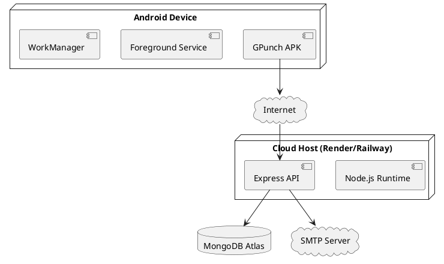

#### C.3 Authentication lifecycle state diagram (PlantUML)

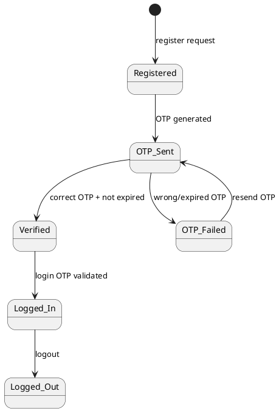

#### C.4 Attendance lifecycle state diagram (PlantUML)

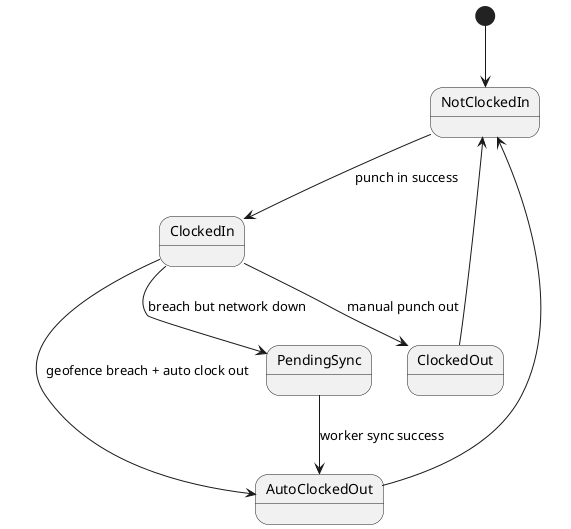

#### C.5 Data consistency notes

- Open attendance record is represented by `clockOutTime = null`.
- Double clock-in is prevented by checking for an existing open record.
- Duration is computed only at clock-out time.
- Singleton geofence document avoids ambiguous active-zone selection.

#### C.6 Security boundary notes

- Public endpoints: auth register/login/verify/resend, health, seed (with secret)
- Protected endpoints: punch, audit, admin operations
- Admin operations: additional role check after JWT validation

### D. Expanded System Implementation Notes

#### D.1 Backend startup behavior

The backend starts Express server, sets security middleware, and attempts MongoDB connection. In development mode, if initial connection fails, retry logic keeps server alive while repeatedly attempting reconnection. This improves developer experience and avoids immediate crash loops.

#### D.2 Validation-first route design

Each route validates request shape and ranges first. This prevents invalid data from reaching core business logic and reduces runtime surprises.

Examples:
- latitude range: -90 to +90
- longitude range: -180 to +180
- radius range: 10 to 100000
- email format check and normalization

#### D.3 Auth route detailed flow

Registration:
1. Validate payload
2. Load geofence config
3. Validate domain against allowed domains
4. Create/refresh OTP
5. Send OTP email

Verify OTP:
1. Validate request
2. Find user
3. Verify OTP value and expiry
4. Enforce device match if already bound
5. Bind device and issue token

Login:
1. Validate email/device
2. Enforce verified + active + bound device
3. Generate OTP and email

#### D.4 Punch route detailed flow

Clock-in:
1. Validate payload
2. Validate device match
3. Load geofence
4. Compute distance
5. Reject outside zone and audit
6. Ensure no open record
7. Create open attendance record

Clock-out:
1. Validate payload
2. Validate device
3. Fetch open record
4. Set clock-out location and time
5. Compute duration in minutes
6. Save closed record

#### D.5 Admin route detailed flow

Admin routes provide operational controls:
- geofence configuration
- user listing
- device reset
- attendance and summary reports
- absentees endpoint
- CSV export

The implementation uses server-side sanitization for search filters and explicit event type whitelisting in audit log filters.

#### D.6 Android Dashboard behavior walkthrough

The dashboard initializes session, permissions, view model observers, geofence config, punch status, and history. It checks location settings with resolvable dialogs so novice users can enable high-accuracy mode easily.

Clock-in click logic sequence:
1. Ensure latest location is available
2. Block if mock location is detected
3. Local pre-check for geofence distance
4. Call ViewModel clockIn
5. On success, persist session and start foreground service

#### D.7 Foreground geofence monitor walkthrough

`GeofenceMonitorService` is responsible for trusted automatic behavior:
- runs as foreground service to survive background restrictions
- skips first location to allow stabilization
- applies grace period after clock-in
- adapts polling rate for battery optimization
- auto clock-out on breach
- fallback queue when offline

#### D.8 WorkManager retry behavior

`PendingClockOutWorker` retries until successful condition:
- loads payload from worker input
- calls same clock-out API
- treats 404/409 as effectively resolved state
- retries on transient network/server failures

This is an example of **idempotent-like practical handling** in real mobile systems.

#### D.9 Error-handling strategy

- API returns structured JSON errors
- UI shows readable toast messages
- best-effort audit logging does not block main response path
- server uses global error handler for unknown exceptions

#### D.10 Module dependency map (PlantUML)

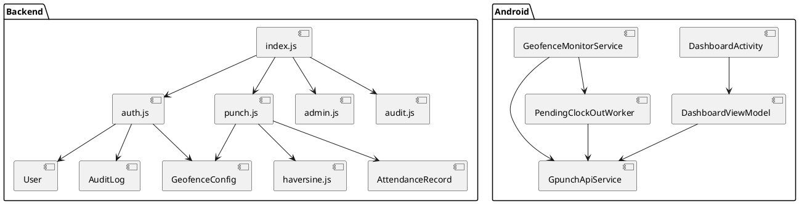

#### D.11 Sample API input/output examples

**Register request input**
```json
{
  "name": "Student A",
  "email": "studenta@psgtech.ac.in",
  "androidId": "a1b2c3d4"
}
```

**Register response output (success)**
```json
{
  "success": true,
  "message": "OTP sent to studenta@psgtech.ac.in."
}
```

**Clock-in rejection output (outside geofence)**
```json
{
  "success": false,
  "message": "You are 240m away from the work zone (max 100m).",
  "distance": 240,
  "allowedRadius": 100
}
```

#### D.12 Additional I/O screenshot placeholders

- Registration success screen:  
  
- Clock-out duration toast:  
  
- Attendance history tab:  
  
- CSV download response in Postman:  
  

### E. Expanded Testing Notes

#### E.1 Testing strategy

Testing is arranged in layers:
1. utility-level correctness (distance math)
2. auth scenario tests
3. API behavior tests
4. integration-level manual runs
5. negative and security path checks

This layered strategy detects both coding bugs and requirement mismatch.

#### E.2 Test environment summary

- Backend runtime: Node.js 18+
- Test framework: Jest + Supertest
- Mocking: Jest model mocks for isolation
- Mobile validation: manual scenario testing on Android device/emulator

#### E.3 Detailed backend test results snapshot

Executed command:

```bash
cd backend && npm test
```

Observed output summary:
- Test suites: 2 passed
- Tests: 10 passed
- Files covered include `haversine.test.js` and `auth.test.js`

#### E.4 Extended manual test scenarios

| Scenario | Steps | Expected |
|---|---|---|
| OTP resend flow | Request OTP, wait, resend | New OTP issued, previous invalidated by latest save |
| Grace period check | Clock in then move quickly | Auto clock-out should not trigger in first grace window |
| Device reset flow | Admin resets device, user logs in new phone | New device successfully binds after OTP |
| Offline auto punch-out | Disable network on breach | Worker queued, later syncs when online |

#### E.5 Security-focused test ideas (future extension)

- Token tampering attempt (modified JWT payload)
- Replay of expired OTP
- High-rate register/login abuse simulation
- Invalid query parameters for admin filters

#### E.6 Boundary value testing ideas

- latitude = -90, 90
- longitude = -180, 180
- radius = 10, 100000
- OTP length < 6, > 6
- very old/very new timestamps in records

#### E.7 Defect prevention checklist

- Validate all external input
- Keep server-side source of truth for security decisions
- Avoid exposing secret/internal fields
- Keep retry logic idempotent-safe
- Ensure clear user-facing error messages

### F. Professional Software Engineering Practice Notes

#### F.1 Secure-by-default behavior in GPunch

The project demonstrates secure defaults:
- middleware hardening (`helmet`)
- strict JSON body size limits
- route-specific and global rate limits
- role-based authorization checks
- explicit type parsing and validation

#### F.2 Maintainability and readability

Code is modular, with route separation and dedicated models. Android app groups features by concern (`api`, `models`, `services`, `ui`, `utils`, `workers`). This structure reduces cognitive load for newcomers.

#### F.3 Observability and diagnostics

Health endpoint + audit logs provide both technical and security visibility. This is important for real deployment operations and incident analysis.

#### F.4 Scalability discussion

For single-campus deployment, architecture is sufficient. For multi-campus scaling, suggested next steps:
- support multiple active geofence configs
- add tenant/campus identifier
- partition attendance queries by campus
- add caching for frequently used configuration

#### F.5 Reliability and resilience discussion

Reliability is not only uptime; it includes data correctness under imperfect conditions (network loss, GPS drift, user mistakes). WorkManager queue, geofence revalidation, and explicit error states provide practical resilience.

### G. Viva / Evaluation Support Notes (Beginner Revision Section)

#### G.1 Frequently asked technical questions with short answers

1. **Why not trust app location directly?**  
   Because app-side checks can be bypassed; server must validate.

2. **Why use both auth middleware and admin middleware?**  
   Auth verifies identity; admin middleware verifies privilege level.

3. **How does device binding prevent proxy punching?**  
   Account can only operate from bound device ID.

4. **Why keep audit logs for failed actions?**  
   Failures are security signals; admins need traceability.

5. **What happens if internet fails during auto clock-out?**  
   Payload is queued and retried by WorkManager.

#### G.2 Formula explanation notes

Haversine calculates shortest surface distance between two GPS points on Earth’s sphere approximation.


a = sin²(Δlat/2) + cos(lat1)·cos(lat2)·sin²(Δlon/2)  
c = 2·atan2(√a, √(1−a))  
d = R·c, where R = 6,371,000 m

This gives distance in meters, used to compare with allowed radius.

#### G.3 Sample viva flow narrative

- Explain problem statement in one minute.
- Explain three security layers (OTP + device + geofence).
- Show architecture and one sequence diagram.
- Show one backend route and one Android service.
- Show test report and failure handling.
- End with future enhancements.

### H. Additional Bibliography for Deep Study

9. OWASP Cheat Sheet Series – Authentication, Input Validation, REST Security.  
10. Android Developers – Location and context APIs.  
11. Android Developers – Background work and modern app architecture.  
12. MongoDB Manual – Schema design and indexing.  
13. Node.js Best Practices (community references).  
14. Martin Fowler – Patterns of Enterprise Application Architecture.  
15. IEEE/ACM papers on geofencing and mobile location reliability.

### I. Final Submission Notes

- Keep this markdown as source-of-truth textual report.
- Generate DOCX from this file and apply final college formatting where required.
- Replace placeholder image links with real screenshots from your final demo run.
- Replace PlantUML placeholders with rendered final diagrams in submission copy.


### J. Chapter-Wise Detailed Learning Notes (Extended Write-Up)

#### J.1 Chapter 1 extended explanatory notes

This chapter is usually evaluated to check whether the team truly understands the “why” of the project and not only the “how.” For GPunch, the problem context is workplace/campus attendance fraud and weak trust in conventional systems. A good introduction clearly explains:

1. **Business pain point:** organizations need attendance records they can trust.
2. **Technical challenge:** location and identity claims can be faked.
3. **User adoption challenge:** heavy systems (biometrics/maps/password management) reduce usability.
4. **Target balance:** secure + simple + cost-effective.

GPunch addresses this by intentionally using familiar user actions (email OTP and button tap) while strengthening backend verification. This design principle is called **secure simplification**: make the user flow simple but put security complexity in backend validation and monitoring.

A novice developer should remember this engineering lesson: *good system design is not just adding more checks; it is placing checks at correct layers with least user friction.*

#### J.2 Chapter 2 (system analysis) extended explanatory notes

System analysis is where requirements become measurable. In many student projects, this chapter becomes generic text. A stronger version links every requirement with:
- actor
- trigger
- input
- validation
- processing
- output
- error conditions
- test evidence

For example, “clock in” is not just one button action:
- Actor: employee
- Preconditions: authenticated token, bound device, geofence config exists
- Inputs: latitude, longitude, androidId
- Validations: coordinate range, device match, geofence active
- Processing: distance compute + open record check
- Output: attendance record or structured rejection

Writing requirements like this reduces ambiguity and improves testability.

#### J.3 Chapter 3 (system design) extended explanatory notes

Good design chapter should answer:
- What components exist?
- How do they communicate?
- Which component owns final security decision?
- How data moves and transforms?
- What states and transitions are possible?

In GPunch, the design uses client checks for user feedback and server checks for trust decisions. This dual-layer pattern is common in real systems:
- client pre-check for fast feedback
- server authoritative check for final acceptance

This prevents “false trust” from app-only logic.

#### J.4 Chapter 4 (implementation) extended explanatory notes

Implementation chapter should include both code structure and reasoning:
- Why route-level validators are added before logic
- Why middleware is centralized
- Why audit writes are best-effort in some branches
- Why offline retry uses persistent worker instead of plain thread/timer

A good implementation section teaches maintainers where to modify behavior safely. For instance:
- To add new security event type → update enum/list and admin filters
- To add second geofence → schema + selection strategy changes needed
- To tune battery behavior → adjust service polling thresholds

#### J.5 Chapter 5 (testing) extended explanatory notes

Testing should reflect requirement risk. High-risk paths deserve explicit tests:
- Unauthorized device attempts
- Out-of-bounds punch attempts
- OTP invalid and expiry flows
- Retry behavior under network loss

Even when full mobile automation is not implemented, clear manual test protocols and expected outcomes make evaluation stronger.

### K. Detailed API Notes for Beginners

#### K.1 Auth API learning notes

`POST /api/auth/register` is not only “create user.” It also performs governance checks (allowed domain), generates secure temporary OTP, and sends an out-of-band verification message by email.

Important API design points:
- Response should be informative but not leak sensitive internals.
- Domain mismatch returns controlled 403.
- Duplicate verified account returns conflict status.
- Invalid payload returns structured validation errors.

`POST /api/auth/verify-otp` finalizes trust bootstrap:
- OTP must match exactly (string comparison)
- OTP must be within validity window
- Device mismatch should be audited
- JWT should include minimum necessary claims

`POST /api/auth/login` in passwordless mode sends fresh OTP each session initiation. This reduces risk of long-lived shared secrets.

#### K.2 Punch API learning notes

`POST /api/punch/in` performs several essential checks in sequence. Sequence design matters because each check can reject early:
1. payload validity
2. device ownership check
3. geofence config presence
4. distance computation
5. open-session guard (no duplicate clock-in)

The order keeps response deterministic and easier to debug.

`POST /api/punch/out` closes currently open record. Duration is derived rather than user-supplied, preventing tampering.

`GET /api/punch/status` and `/history` improve UX by restoring app state and presenting recent records.

#### K.3 Admin API learning notes

Admin APIs must be explicit and constrained. In GPunch:
- geofence update has strict numeric validation
- filter fields are sanitized/whitelisted
- CSV output escapes cells for correctness

These details are practical examples of secure and robust backend coding.

### L. Detailed Android Notes for Beginners

#### L.1 Activity responsibilities

`DashboardActivity` handles UI and user interaction orchestration. It should not directly own heavy business logic. Instead, it observes `DashboardViewModel` states and updates UI accordingly.

Good practices illustrated:
- permission launcher usage for runtime permissions
- location settings resolution via intent sender
- state-driven UI updates (loading/success/error)
- graceful toasts for user-facing feedback

#### L.2 ViewModel responsibilities

ViewModels coordinate API calls and expose observable state. This prevents UI breakage during configuration changes and keeps code testable.

In novice terms: ViewModel acts as a “manager” between screen and backend.

#### L.3 SessionManager purpose

SessionManager persists local session data such as token and user profile essentials. Without this, app would lose session context after process restart.

#### L.4 Geofence service engineering choices

Foreground service is needed because Android restricts unrestricted background execution. Persistent notification communicates to users that location is actively monitored for attendance integrity.

Adaptive polling strategy:
- moving user → shorter interval for responsive breach detection
- stationary user → relaxed interval for battery efficiency

This is a real-world optimization tradeoff example.

#### L.5 Worker retry semantics

`PendingClockOutWorker` exemplifies robust mobile architecture:
- stores necessary payload in input data
- waits for required network constraint
- retries on transient exceptions
- marks success for already-resolved states (404/409 handling)

This prevents duplicate user confusion while protecting attendance correctness.

### M. Extended Testing Documentation

#### M.1 Test case narrative details

**TC-01 Invalid domain registration**  
Input email from non-whitelisted domain. Backend should reject and audit. This verifies governance control.

**TC-03 Wrong OTP verification**  
Submit incorrect OTP. Backend should reject and log security event. This verifies brute-force signal visibility.

**TC-04 Unauthorized device login**  
Use registered account on different Android ID. Backend should reject with 403 and audit. This verifies anti-proxy protection.

**TC-07 Out-of-bounds clock in**  
Simulate location outside radius. API should deny with distance metadata. This verifies geofence enforcement.

**TC-10 Auto clock-out**  
After successful clock-in, move beyond radius and observe background service behavior. Attendance should close automatically.

**TC-14 Offline retry**  
Force network loss during auto clock-out. Worker should eventually sync when network returns.

#### M.2 Non-functional test ideas

- Response time under normal load
- Stability of long-running foreground monitoring
- Battery impact observation over one hour
- Robustness with intermittent connectivity
- Usability feedback from first-time users

#### M.3 Regression checklist

After any change, verify:
- register/login flow still works
- clock-in/out still records accurately
- admin geofence update still applies
- audit logs still show security events
- offline retry still processes queue

### N. Extended Professional Documentation Material

#### N.1 Coding standards and maintainability recommendations

- Keep route handlers focused on one responsibility.
- Reuse validation utilities where possible.
- Keep model schemas strict with descriptive field names.
- Avoid silent failures except explicitly best-effort audit paths.
- Keep error messages user-friendly but non-sensitive.

#### N.2 Security hardening recommendations (future)

- Add device integrity checks (Play Integrity API)
- Add JWT refresh-token strategy with revocation support
- Add stronger OTP attempt counters per user/email
- Add geofence hysteresis logic to reduce boundary oscillation
- Add optional signed location attestations where available

#### N.3 Performance optimization recommendations (future)

- Cache active geofence config in memory with TTL
- Index frequently queried fields in attendance analytics
- Use pagination consistently in all report endpoints
- Use background batching for non-critical audit metadata writes

#### N.4 Operational runbook summary

1. Deploy backend with required env variables.
2. Seed first admin securely.
3. Configure geofence and allowed domain.
4. Install app and verify registration flow.
5. Validate clock-in/out and audit event visibility.
6. Periodically export attendance and monitor logs.

#### N.5 Troubleshooting guide for beginners

| Symptom | Likely reason | Fix |
|---|---|---|
| OTP not received | SMTP config issue | Validate SMTP host/user/pass and sender limits |
| Clock-in denied always | wrong geofence config or GPS off | Recheck radius/coordinates and enable high-accuracy GPS |
| Unauthorized device error | device mismatch | Admin reset-device for user |
| Auto clock-out not syncing | no network | Verify worker constraints and connectivity |
| Empty admin reports | date filter mismatch | Verify date/query format and timezone handling |

#### N.6 Data ethics and privacy note

System stores operationally necessary location and device data for attendance verification only. No biometric capture is performed. Access to sensitive operations is role-protected. Teams should add organizational privacy policy communication for production adoption.

#### N.7 Documentation quality checklist

- Does every section map to requested template? ✅
- Are architecture and workflows explained for beginners? ✅
- Are diagrams included (PlantUML placeholders)? ✅
- Are online concept images included? ✅
- Are implementation modules linked to actual code paths? ✅
- Are testing details and outcomes documented? ✅

### O. Additional PlantUML Placeholders (Optional Replaceable Diagrams)

#### O.1 Component diagram

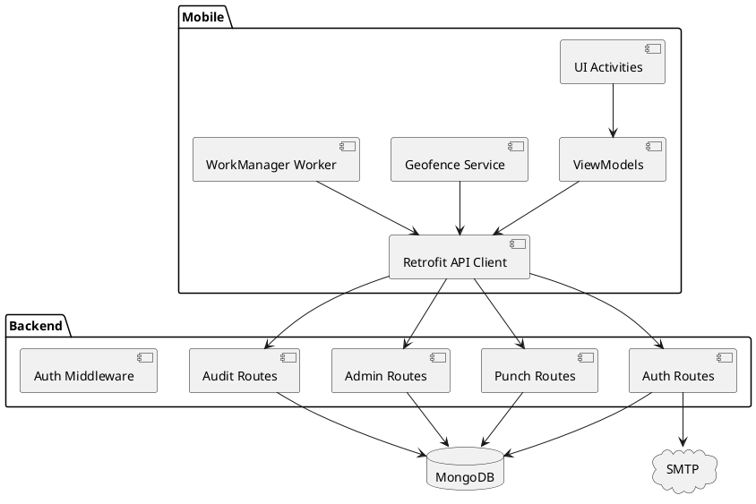

#### O.2 Admin reporting sequence diagram

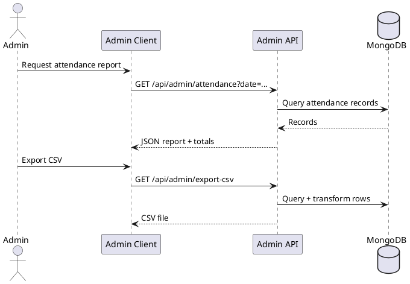

#### O.3 Error handling activity diagram

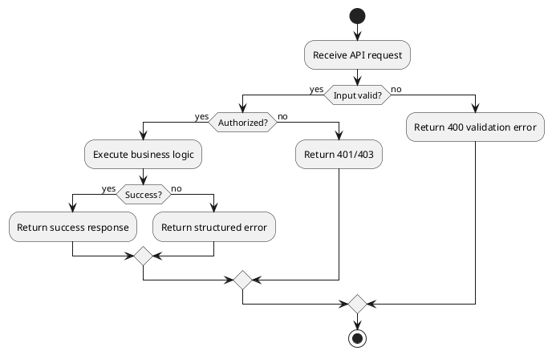

### P. Final Viva Presentation Support Bullets

- Problem solved: reliable on-site attendance without biometrics/maps/passwords.
- Core innovation: three-layer trust (OTP + Device + Geofence).
- Reliability highlight: offline-safe auto clock-out queue.
- Security highlight: server-side geofence and audit-first design.
- Engineering highlight: modular backend + MVVM Android architecture.

