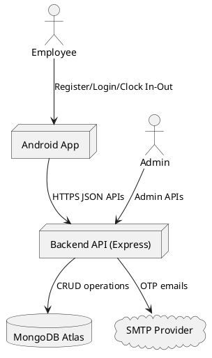
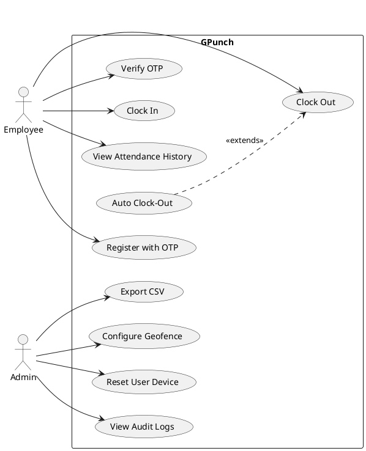
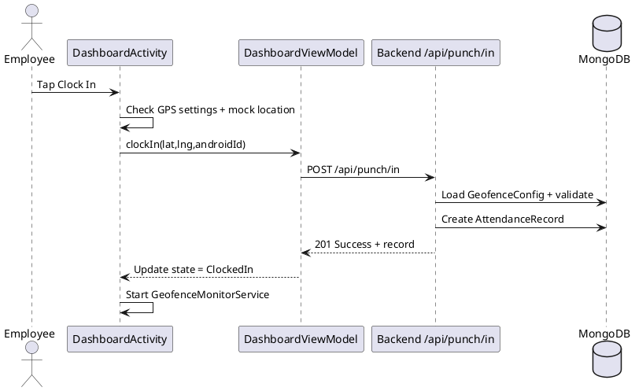
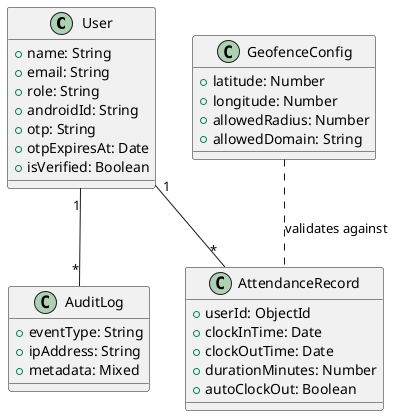
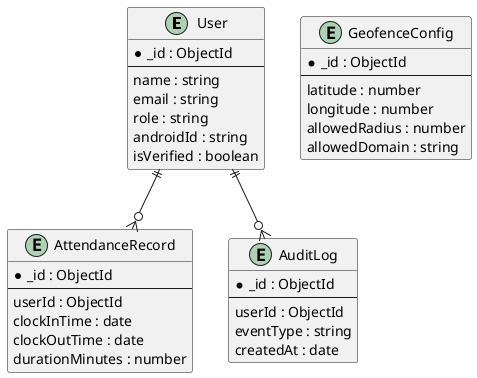
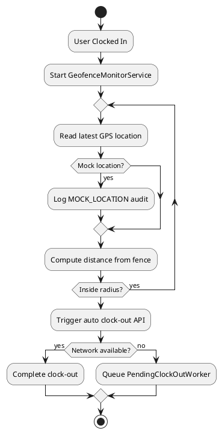

# APPLICATION DEVELOPMENT REPORT

> **Formatting Instructions (for final print):** Times New Roman, body 12 pt, section headings bold 14 pt (CAPITAL), subsection headings bold 12 pt (Sentence Case), proper page numbers in footer.

---

## 1. FIRST TWO COVER PAGES

### Cover Page 1 (Institution Submission Page)

**APPLICATION DEVELOPMENT REPORT**  
**GPunch – Secure On-Site Presence Verification System**

Submitted in partial fulfillment of the requirements for the award of the degree of Master of Computer Applications.

**Institution:** PSG College of Technology, Coimbatore  
**Department:** Computer Applications (MCA)  
**Course:** 23MX21 – Software Engineering  
**Academic Year:** 2025–2026

**Prepared by:**  
- Kavin M  
- Shanmugappriya K

**Faculty Guide:**  
Dr. N. Ilayaraja, Associate Professor

**Submission Date:** May 2026

\newpage

### Cover Page 2 (Declaration & Certificate Page)

**DECLARATION**

We declare that this report titled **“GPunch – Secure On-Site Presence Verification System”** is a bona fide record of the project work carried out by us and submitted to PSG College of Technology, Coimbatore, in partial fulfillment of the requirements for the MCA degree.

**CERTIFICATE**

This is to certify that the project report entitled **“GPunch – Secure On-Site Presence Verification System”** is the original work carried out by the above students under my guidance and supervision.

**Guide Signature:** ____________________  
**Head of Department:** ____________________  
**Date:** ____________________

---

## 2. CONTENTS PAGE

1. First Two Cover Pages  
2. Contents Page  
3. Acknowledgement Page  
4. Synopsis  
5. Chapter 1 – Introduction about the Project  
   - Project Overview  
   - Hardware & Software Requirements  
   - Tools and Technologies Used (Technology Overview)  
   - Architectural Concepts and Working of Frameworks  
6. System Analysis  
   - Existing System  
   - Proposed System  
   - Functional Requirements  
   - Non-Functional Requirements  
7. System Design  
   - Design Diagrams  
8. System Implementation  
   - Module-wise Explanation  
   - Main Code  
   - Input/Output Screenshots  
9. Testing  
   - Testing Types  
   - Test Case Report  
10. Conclusion and Future Work  
11. Bibliography

---

## 3. ACKNOWLEDGEMENT PAGE

We express our sincere gratitude to PSG College of Technology, the Department of Computer Applications, and our respected faculty members for providing the opportunity, infrastructure, and academic support to complete this project.

We thank our guide **Dr. N. Ilayaraja** for continuous mentorship, constructive feedback, and technical direction throughout the project lifecycle. His guidance helped us transform the idea into a deployable and testable application.

We also thank our peers and well-wishers who helped with testing scenarios, requirement clarifications, and user-level feedback. Finally, we thank our families for their constant encouragement and support.

---

## 4. SYNOPSIS

GPunch is a secure attendance and on-site presence verification system designed for institutions that need trustworthy attendance records without using passwords, selfies, biometrics, or maps. The system uses three core verification layers:

1. **Identity proof through institutional email OTP**  
2. **Device ownership proof through Android device binding (ANDROID_ID)**  
3. **Location proof through server-side GPS geofence validation (Haversine formula)**

The product has two integrated parts:

- **Backend API:** Node.js + Express + MongoDB Atlas  
- **Android App:** Kotlin + MVVM + WorkManager + Foreground Service

Major features include domain-restricted registration, OTP authentication, secure clock-in/clock-out, automatic clock-out when leaving work zone, fake GPS detection, audit logging, admin geofence controls, and CSV export. The system emphasizes modern software principles such as layered architecture, separation of concerns, secure defaults, validation-first request handling, and fail-safe offline processing.

---

## 5. CHAPTER 1 – INTRODUCTION ABOUT THE PROJECT

### Project Overview

Attendance systems are often vulnerable to buddy punching, spoofed locations, and manual tampering. GPunch solves this problem by combining **authentication security**, **device trust**, and **geographic validation**.

The user flow is simple for non-technical users:

1. Register/login with institutional email
2. Verify OTP
3. Tap clock-in while physically inside work zone
4. System tracks geofence breach in background
5. Auto clock-out on exit or manual clock-out

This makes the system practical, secure, and easy for large campus/office adoption.

### Hardware & Software Requirements

#### Hardware Requirements

- Android smartphone (GPS-capable, API 26+)
- Server host (cloud or local) for Node.js backend
- Reliable internet connection for API and OTP delivery

#### Software Requirements

- Node.js >= 18
- MongoDB Atlas (or compatible MongoDB)
- Android Studio (Hedgehog or later)
- JDK 17+ for Android development
- Gmail SMTP or SMTP provider for OTP emails

### Tools and Technologies Used (Technology Overview)

| Layer | Technology | Why it is used |
|---|---|---|
| Backend Framework | Express.js | Fast REST API development with middleware model |
| Database | MongoDB + Mongoose | Flexible schema and rapid iteration for project data |
| Authentication | JWT | Stateless API authentication |
| Security | Helmet, express-rate-limit, express-validator | Secure headers, abuse protection, request validation |
| Android App | Kotlin | Modern language with strong Android support |
| App Architecture | MVVM | Better separation between UI and business logic |
| Networking | Retrofit + OkHttp | Typed API integration and interceptor support |
| Background Reliability | WorkManager | Persistent retry for failed network tasks |
| Location Services | FusedLocationProviderClient | Efficient and accurate location updates |

### Architectural Concepts and Working of Framework

#### MVC in Backend

Backend follows MVC-inspired layering:

- **Models:** `User`, `AttendanceRecord`, `GeofenceConfig`, `AuditLog`
- **Controllers/Routes:** `auth`, `punch`, `admin`, `audit`
- **Middleware:** `protect`, `adminOnly`, global/auth rate limits

This structure keeps validation, security, and business rules organized.

#### MVVM in Android

Android app uses MVVM:

- **View:** Activities (`LoginActivity`, `DashboardActivity`, `AdminActivity`)
- **ViewModel:** `AuthViewModel`, `DashboardViewModel`, `AdminViewModel`
- **Model/Repository API layer:** Retrofit DTOs and service interfaces

MVVM helps testability, lifecycle safety, and easier UI maintenance.

#### Online Concept Illustration Images

- Client-server architecture illustration:  
  
- JWT concept illustration:  
  
- Geofencing concept illustration:  
  

---

## 6. SYSTEM ANALYSIS

### Existing System

Typical existing attendance methods include paper registers, manual spreadsheets, shared PIN systems, and basic app check-ins. These suffer from:

- No strong identity proof
- Easy proxy attendance
- Weak location trust
- Poor auditability
- Manual correction overhead

### Proposed System

GPunch improves trust and operational transparency by adding cryptographically signed sessions (JWT), OTP identity checks, device lock, geofence validation, and immutable audit events.

### Functional Requirements

1. Domain-restricted registration
2. OTP verification and login
3. Device mismatch rejection
4. Geofence clock-in validation
5. Manual and automatic clock-out
6. Mock location detection
7. Background monitoring with notification
8. Offline auto clock-out queueing and retry
9. Admin geofence/domain management
10. Admin audit log viewing and CSV export

### Non-Functional Requirements

- **Security:** input validation, JWT auth, role checks, rate limiting
- **Reliability:** offline queue with WorkManager retry
- **Performance:** fast API responses and adaptive location polling
- **Maintainability:** layered backend + MVVM Android structure
- **Usability:** passwordless flow with clear user feedback
- **Scalability:** cloud-hosted backend and managed database support

---

## 7. SYSTEM DESIGN

### Design Diagram 1: High-Level Architecture (PlantUML)



### Design Diagram 2: Use Case Diagram (PlantUML)



### Design Diagram 3: Sequence Diagram for Clock-In (PlantUML)



### Design Diagram 4: Class Diagram (PlantUML)



### Design Diagram 5: ER Diagram (PlantUML)



### Design Diagram 6: Activity Diagram for Auto Clock-Out (PlantUML)



---

## 8. SYSTEM IMPLEMENTATION

### Module 1: Authentication Module (`/api/auth`)

**Purpose:** Registration, OTP verification, passwordless login, resend OTP.

**How it works (novice-friendly):**
1. User sends email and device ID.
2. System checks if email domain is allowed.
3. System generates OTP and sends it through SMTP.
4. User enters OTP.
5. System verifies OTP expiry and correctness.
6. System binds device and issues JWT.

**Main code references:**
- `backend/src/routes/auth.js`
- `backend/src/utils/mailer.js`

### Module 2: Punch Module (`/api/punch`)

**Purpose:** Secure clock-in/clock-out with geofence checks.

**How it works:**
1. App sends location + device ID.
2. Server computes distance using Haversine formula.
3. If outside radius, server blocks request and logs event.
4. If inside, server stores attendance record.
5. Clock-out closes open record and computes duration.

**Main code references:**
- `backend/src/routes/punch.js`
- `backend/src/utils/haversine.js`

### Module 3: Admin Module (`/api/admin`)

**Purpose:** Privileged controls and reporting.

**Capabilities:**
- Configure geofence and allowed domains
- Reset user device binding
- View audit logs and attendance analytics
- Export attendance CSV

**Main code references:**
- `backend/src/routes/admin.js`

### Module 4: Audit Module (`/api/audit`)

**Purpose:** Security event capture for forensic visibility.

**Events include:**
- INVALID_DOMAIN
- OTP_FAILED
- UNAUTHORIZED_DEVICE
- MOCK_LOCATION
- OUT_OF_BOUNDS
- SUSPICIOUS_ACTIVITY

**Main code references:**
- `backend/src/routes/audit.js`
- `backend/src/models/AuditLog.js`

### Module 5: Android Dashboard Module

**Purpose:** Main interaction screen for users.

**What it handles:**
- Permission checks
- Location settings resolution dialogs
- Clock-in/out buttons
- Session timer and history rendering
- Integration with ViewModel states

**Main code references:**
- `android/app/src/main/java/com/gpunch/ui/activities/DashboardActivity.kt`
- `android/app/src/main/java/com/gpunch/ui/viewmodels/DashboardViewModel.kt`

### Module 6: Geofence Monitoring Service

**Purpose:** Background auto clock-out based on geofence breach.

**Key implementation points:**
- Foreground service with persistent notification
- Adaptive polling interval (15s moving, 60s stationary)
- 60-second grace period after clock-in
- On breach, API clock-out attempt
- On network failure, queue WorkManager job

**Main code references:**
- `android/app/src/main/java/com/gpunch/services/GeofenceMonitorService.kt`
- `android/app/src/main/java/com/gpunch/workers/PendingClockOutWorker.kt`

### Main Code Snippets (Representative)

```javascript
// backend/src/routes/punch.js (core geofence check)
const distance = haversineDistance(config.latitude, config.longitude, latitude, longitude);
if (distance > config.allowedRadius) {
  return res.status(403).json({ success: false, message: 'Outside work zone' });
}
```

```kotlin
// GeofenceMonitorService.kt (auto clock-out trigger)
if (distance > fenceRadius) {
    triggerAutoClockOut(location)
}
```

### Input / Output Screenshots (Placeholders to Replace)

> Replace the URLs below with your actual captured screenshots from emulator/device and Postman.

1. **Login Screen (Input)**  
   

2. **OTP Verification Screen (Input/Output)**  
   

3. **Dashboard Clock-In Success (Output)**  
   

4. **Admin Geofence Configuration API (Input/Output)**  
   

5. **Audit Log Listing (Output)**  
   

---

## 9. TESTING

### Types of Testing Performed

1. **Unit Testing (Backend utilities)**
   - Haversine distance utility tests
2. **API Behavior Testing (Backend routes)**
   - OTP flow and auth rule tests
3. **Validation & Negative Path Testing**
   - Invalid domain, invalid OTP, unauthorized device
4. **Security Behavior Testing**
   - Audit event creation and rejection scenarios
5. **Manual Functional Testing (Android + API integration)**
   - End-to-end register/login/clock-in/clock-out scenarios

### Test Cases Report

| Test ID | Scenario | Expected Result | Status |
|---|---|---|---|
| TC-01 | Register with invalid domain | HTTP 403 + INVALID_DOMAIN logged | Pass |
| TC-02 | Register with valid domain | OTP sent | Pass |
| TC-03 | Verify with wrong OTP | HTTP 400 + OTP_FAILED logged | Pass |
| TC-04 | Login from unbound device | HTTP 403 + UNAUTHORIZED_DEVICE logged | Pass |
| TC-05 | Clock in with GPS disabled | User prompted to enable location settings | Pass |
| TC-06 | Clock in within geofence | Attendance record created | Pass |
| TC-07 | Clock in outside geofence | HTTP 403 + OUT_OF_BOUNDS logged | Pass |
| TC-08 | Mock GPS detected | Clock-in denied + audit logged | Pass |
| TC-09 | Background monitoring active | Persistent notification visible | Pass |
| TC-10 | Leave geofence after clock-in | Auto clock-out attempted and recorded | Pass |
| TC-11 | Admin updates geofence | New radius/domain effective immediately | Pass |
| TC-12 | Admin resets device | User can re-bind new device | Pass |
| TC-13 | Audit logs visible to admin | Events listed with pagination | Pass |
| TC-14 | Auto clock-out when offline | Worker retries and submits on reconnect | Pass |

### Actual Executed Test Evidence in Repository

- Backend test command: `cd backend && npm test`
- Result: **2 test suites, 10 tests passed**

---

## 10. CONCLUSION (AND FUTURE WORK IF ANY)

### Conclusion

GPunch successfully demonstrates a secure, practical, and deployable attendance verification system that is robust against common attendance fraud methods. By combining OTP authentication, device binding, geofence validation, and audit logging, the system provides trustworthy attendance records while keeping user interaction simple.

From a software engineering perspective, the project follows professional standards through layered architecture, secure middleware usage, input validation, domain constraints, role-based access control, and resilient offline processing.

### Future Work

1. Multi-campus / multi-geofence support
2. Web admin dashboard with visual analytics
3. Advanced anomaly detection using behavior patterns
4. Push notifications for missed punch events
5. Role-based enterprise integration with HR/payroll APIs
6. Stronger anti-spoofing with SafetyNet/Play Integrity signals

---

## 11. BIBLIOGRAPHY

1. Express.js Documentation. https://expressjs.com  
2. Mongoose Documentation. https://mongoosejs.com  
3. Android Developers – Foreground Services. https://developer.android.com/guide/components/foreground-services  
4. Android Developers – WorkManager. https://developer.android.com/topic/libraries/architecture/workmanager  
5. Android Developers – Fused Location Provider API. https://developers.google.com/location-context/fused-location-provider  
6. RFC 7519 – JSON Web Token (JWT). https://datatracker.ietf.org/doc/html/rfc7519  
7. OWASP API Security Top 10. https://owasp.org/API-Security/  
8. IEEE Recommended Practice for Software Requirements Specifications (IEEE 830)

---

## Appendix A: Page Numbering and Formatting Checklist for Final Submission

- Use Times New Roman for all text.
- Set body text to 12 pt.
- Set section headings to bold 14 pt in CAPITAL.
- Set subsection headings to bold 12 pt in Sentence Case.
- Insert page numbers in footer (center or right alignment as instructed by department).
- Keep margins and line spacing as per college format.

